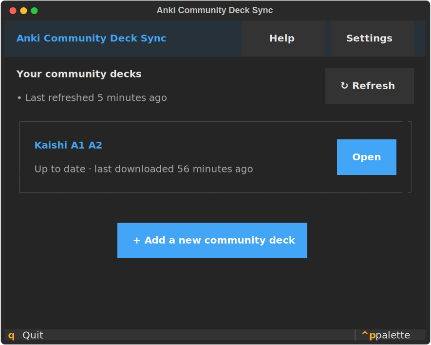

# Anki-Git-UI

<p align="center">
  
</p>

A friendly terminal UI for [`anki-gitify`](https://github.com/boabab/anki-gitify): subscribe to Anki deck repositories on GitHub, prepare them as `.apkg` files, and import them into your local Anki collection.

Built with [Textual](https://textual.textualize.io/) — runs in any modern terminal, mouse and keyboard.

> **Status:** early development (v0.1.0). Expect rough edges.

## Install

Requires Python 3.11–3.13 and a local Anki installation (Anki must be closed during imports).

```bash
pip install -e .
```

Or, with [uv](https://docs.astral.sh/uv/):

```bash
uv sync
```

## Run

```bash
python -m anki_git_ui
# or, after install:
anki-git-ui
```

On first launch you'll be guided through picking your Anki profile and subscribing to your first deck repository.

## Development

```bash
pip install -e ".[dev]"
pytest                       # full suite, including Textual snapshot tests
pytest --snapshot-update     # accept new snapshots after intentional UI changes
ruff check . && ruff format .
```

See [CLAUDE.md](CLAUDE.md) for the full command list, repo conventions, and known gotchas.

## Docs

- [CLAUDE.md](CLAUDE.md) — agent / contributor context
- [docs/ARCHITECTURE.md](docs/ARCHITECTURE.md) — module map and data flow
- [docs/PACKAGING.md](docs/PACKAGING.md) — PyInstaller notes
- [docs/RELEASE-VERIFICATION.md](docs/RELEASE-VERIFICATION.md) — manual QA checklist for releases

## License

MIT
